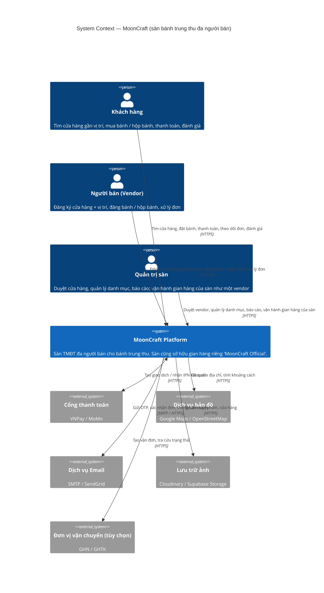

# MoonCraft — System Context Diagram (C4 Level 1)

Sàn thương mại điện tử đa người bán (multi-vendor) chuyên bánh trung thu.
Người bán đăng ký cửa hàng + vị trí, đăng bánh lẻ và hộp bánh; khách tìm cửa hàng
gần mình, đặt hàng và thanh toán. Sàn cũng sở hữu gian hàng riêng ("MoonCraft Official"),
được mô hình hoá như một vendor thường do Admin vận hành.

## Tác nhân

| Ai | Mục tiêu | Tương tác chính |
|---|---|---|
| Khách hàng | Mua bánh trung thu, hộp quà | Tìm cửa hàng theo vị trí; xem bánh lẻ / hộp bánh; giỏ hàng nhiều cửa hàng; thanh toán; theo dõi đơn; đánh giá |
| Người bán | Bán qua sàn | Đăng ký cửa hàng + toạ độ; chờ duyệt; đăng bánh, hộp bánh; tồn kho, giá, khuyến mãi; xử lý đơn; doanh thu |
| Quản trị sàn | Vận hành sàn + bán hàng | Duyệt / khoá cửa hàng; danh mục; khuyến mãi toàn sàn; báo cáo; quản lý gian hàng MoonCraft Official với vai trò vendor |

## Hệ thống ngoài

| Hệ thống | Dùng để | Gợi ý |
|---|---|---|
| Cổng thanh toán | Tạo URL thanh toán, nhận IPN; hoàn tiền | VNPay / MoMo sandbox |
| Dịch vụ bản đồ | Geocode địa chỉ cửa hàng; tính khoảng cách "gần tôi" | Google Maps / OSM Nominatim |
| Email | OTP, xác nhận đơn, kết quả duyệt cửa hàng | SMTP Gmail / SendGrid |
| Lưu trữ ảnh | Ảnh bánh, hộp bánh, logo cửa hàng | Cloudinary / Supabase Storage |
| Vận chuyển (tùy chọn) | Tạo vận đơn, tra trạng thái — chỉ khi không để cửa hàng tự giao | GHN / GHTK |

## Điểm cần chốt trước Level 2 (Container)

1. **Sàn đứng như một vendor** — dùng chung bảng `Store`, thêm cờ `IsPlatformOwned`; Admin có thêm vai trò Vendor trên store đó; hoa hồng = 0.
2. **Giỏ hàng nhiều cửa hàng** — một checkout tách thành nhiều `Order` (mỗi cửa hàng một đơn), một giao dịch thanh toán.
3. **Vị trí** — lưu lat/lng trên `Store`; lọc "gần tôi" bằng Haversine trong SQL.
4. **Vận chuyển** — "cửa hàng tự giao + phí theo khoảng cách" bỏ được một tích hợp ngoài; GHN/GHTK làm sau nếu còn thời gian.
5. **Hộp bánh** — combo cho khách tự chọn vị, hay SKU cố định do cửa hàng định nghĩa? Quyết định model `Product` / `ProductBundle`.
